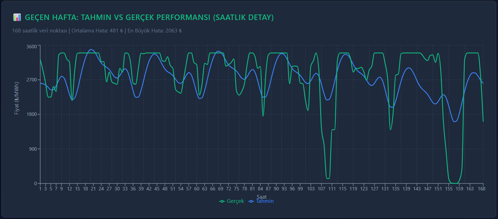
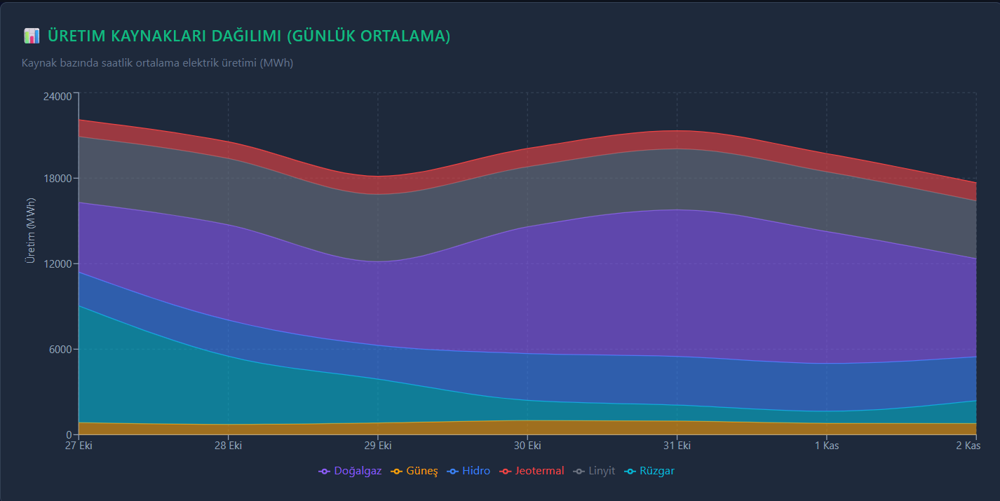
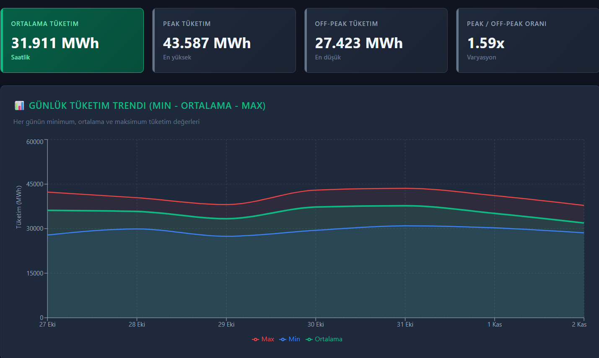

# EPİAŞ Enerji Fiyat Tahmini

Türkiye elektrik piyasası (EPİAŞ) için 7 günlük MCP fiyat tahmini yapan full-stack web uygulaması. 

Prophet time-series modeliyle saatlik tahminler üretiyor, React dashboard'da gösteriyor. Günlük otomatik veri senkronizasyonu ve haftalık model eğitimi için GitHub Actions kullanıyor.

**Veri:** EPİAŞ Şeffaflık Platformu API (17k+ saatlik kayıt)

---

## Özellikler

- 7 günlük MCP fiyat tahmini (Prophet time-series)
- Üretim/tüketim analizi (kaynak bazlı breakdown)
- Model performans takibi (MAPE, MAE, RMSE)
- Günlük veri senkronizasyonu (GitHub Actions)
- Haftalık otomatik model re-training

---

## Stack

**Frontend:** React + TypeScript + Vite + Recharts  
**Backend:** Node.js + Express + TypeScript  
**ML:** Python + Prophet  
**Database:** SQLite  
**CI/CD:** GitHub Actions

### Neden SQLite?

İlk başta PostgreSQL düşündüm ama MVP için SQLite yeterli geldi:
- 17k kayıt için performans sorunu yok
- Tek `.db` dosyası, deployment kolay
- PostgreSQL server kurmaya gerek kalmadı

Ama 100k+ kayıt geçerse PostgreSQL'e migrate etmek gerekecek.

---

## Ekran Görüntüleri

---

## Model Performansı

17k+ saatlik EPİAŞ verisiyle eğitilmiş univariate Prophet modeli. 

**Tipik performans:**
- MAPE: %40-50 arası (fiyat volatilitesine göre değişiyor)
- Univariate model limiti (sadece geçmiş fiyat kullanıyor)

**Hedef:** Talep, üretim, gaz fiyatı eklenerek %15-20 MAPE'ye düşürülecek.

**Bilinen limit:** Ani spike'ları yakalamıyor (santral arızası vs.).

---

## Bilinen Limitler

**Univariate model:** Sadece geçmiş fiyat kullanıyor. Talep, üretim, doğalgaz fiyatı eklenince performans artacak.

**Spike yakalayamıyor:** Santral arızası, gaz kesintisi gibi ani sıçramalarda tahmin yanılıyor. Bunun için anomaly detection veya hybrid model gerekir.

**7+ gün güvenilmez:** Prophet'in yapısı gereği uzun vadeli tahmin zayıf. Kısa vadeli tahmin için tasarlandı.

**SQLite limiti:** 100k+ kayıtta yavaşlayabilir. O noktada PostgreSQL'e geçilmeli.
